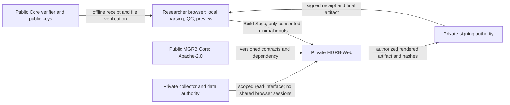

# MGRB architecture boundaries

Public research reproducibility and a protected official service coexist. Existing
published implementations remain reusable; future protected work has a separate home.

| Layer | Canonical owner/location | May contain | Must not cross into public Core/browser bundles |
|---|---|---|---|
| Public Core | TSUCHIYA LAB; `tsuchiyatakahirolab/MGRB` | Generic import/QGIS/QC, evidence schemas, public adapters and metadata, descriptive analytics, Build Spec, basic exports, public verification | No private implementation, private inputs or signing material |
| Private Web | TSUCHIYA LAB; `tsuchiyatakahirolab/MGRB-Web`, private from creation | Hosted UX, protected server orchestration/analytics, premium rendering, watermark operations, service policy | Server logic, secrets, private layers and receipts never enter frontend bundles |
| Private data/collector | Separate authority; `tsuchiyatakahirolab/MGRB-Collector` | Independently controlled acquisition and storage | No collector code, acquisition state, sessions or data copied into Core or Web source |
| Official signing | Separate private server-side authority | Non-exportable production key, authorization policy, receipt registration | Only public verification keys and signed receipts may leave |

Core uses canonical WGS84 separately from Pacific-centred derivatives, preserves
upstream license/provenance, and treats maritime lines as sourced references.
Build Spec compatibility does not imply every hosted-only dataset or recipe can
be reproduced locally. Downloads must report unsupported features explicitly.

Local parsing/filtering may run in-browser; all delivered JavaScript is inspectable.
Protected rendering, advanced analytics, signing and secret watermark operations
stay server-side. No model training on uploaded research data. Any server upload
needs minimal transmission, TLS, ephemeral storage, bounded retention and deletion.

Generic exports require no official key. Official export authority comes from a
signed receipt tied to the final file hash. Watermarks aid attribution; logos aid
recognition. Neither is an authenticity authority. Development identities must
remain explicitly `DEVELOPMENT / NOT OFFICIAL`.

Production signing, public deployment and any paid infrastructure remain owner
gates. No production key is generated as part of the development transition.

## Contribution placement

Keep useful generic functionality public. Put new hosted/premium features in Web,
not in a dormant public folder. Do not move private source into Core to share a
type: publish a small compatible contract instead. Existing v1 styles/UI/renderers
are not removed; their distinctive official/premium evolution continues privately.
Do not modify the independent OCI watcher or collector as part of this boundary work.
