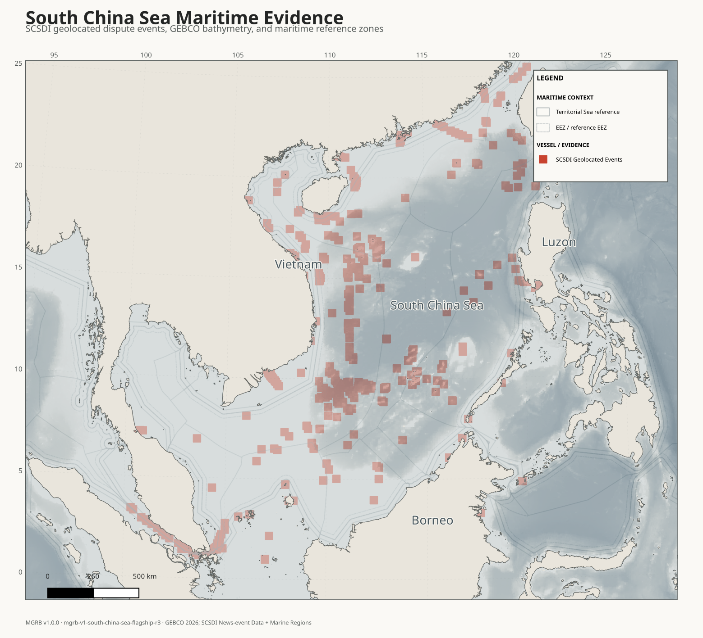

# MGRB

MGRB Core welcomes forks and research reuse under Apache-2.0. See the
[fork policy](FORK_POLICY.md), [identity policy](TRADEMARK_POLICY.md), and
[public/private architecture](ARCHITECTURE_BOUNDARIES.md).

## Maritime Geospatial Research Base

[](https://doi.org/10.5281/zenodo.22172475)

**Turn maritime data into publication-ready maps and reproducible QGIS research
workspaces in minutes.**



The flagship above combines 1,200 geolocated public records from the South China Sea Data
Initiative with GEBCO bathymetry and Marine Regions reference zones. Event points are not
represented as vessel tracks, and maritime-zone lines are not presented as agreed sovereign
boundaries.

## What MGRB does

MGRB automates repetitive maritime GIS preparation: public-source acquisition, clipping,
projection, antimeridian handling, scale-aware detail, cartographic styling, layout,
attribution, provenance, and portable packaging. Researchers choose the study area,
cartographic background, maritime reference layers, and optional local data.

Marine Regions, GEBCO, Natural Earth, GSHHG, and other named providers supply the underlying
geospatial data. QGIS supplies the full GIS environment. MGRB connects them into a
documented, reproducible research workflow; it does not replace QGIS.

## Quick start

```bash
git clone https://github.com/tsuchiyatakahirolab/MGRB.git
cd MGRB
python -m venv .venv
# Windows PowerShell: .venv\Scripts\Activate.ps1
# Linux/macOS: source .venv/bin/activate
python -m pip install -e ".[dev]"
mgrb doctor
mgrb ui
```

The browser UI listens only on `127.0.0.1`. Choose an area, background and maritime layers;
optionally add multiple local files with explicit track/observation/event/infrastructure
semantics; inspect schema/QC; then select **Build Research Package**.

## UI workflow

1. Select a preset or enter a custom WGS84 extent.
2. Select a publication, bathymetry, relief, grayscale, context, imagery-reference, or empty background.
3. Enable the maritime reference layers relevant to the research question.
4. Optionally import multiple datasets, select each semantic type, and confirm only applicable
   ambiguous field mappings.
5. Optionally select a shared date range and collapsed public context/evidence layers.
6. Preview QC and build paper, media, and portable QGIS outputs.

See [Product UI](docs/product-ui.md).

## Supported maritime layers

- Territorial sea, contiguous zone, EEZ/reference EEZ, and sourced maritime boundaries.
- Continental-shelf and user-supplied reference layers when provided.
- Computed median/equidistance output explicitly marked `COMPUTED_REFERENCE`.

Reference geometry retains source and status metadata and is not self-authenticating legal
evidence.

## Supported file formats

CSV, TSV, GeoJSON/JSON, GeoPackage, and Shapefile. MGRB detects common coordinate,
timestamp, identity, and provider-segment fields; ambiguous mappings require confirmation.
The unreleased v1.1 workflow preserves an independent dataset layer, QC record and provenance
record for every input.

## Outputs

- Paper PDF, PNG, SVG, and 85 mm journal preview.
- A distinct, screen-legible media PNG.
- GeoPackages and a relative-path QGIS project.
- Build, source, style, citation, license, and provenance manifests.
- Embedded/sidecar lineage plus `SHA256SUMS` verification.

```bash
mgrb verify path/to/generated-file
```

## QGIS research package

The generated `.qgz` opens with organized base, maritime, user/evidence, event, context, and
optional-analysis groups. Standard metadata records the MGRB version, Git commit, build ID,
source-manifest hash, theme hash, projection, and recommended citation. Full source and
license detail remains in machine-readable sidecars even when the visible footer is disabled.

## Public demos

### Flagship — South China Sea maritime evidence

- South China Sea Data Initiative: News-event Data 2.0.
- Harvard Dataverse DOI: [10.7910/DVN/GCBWA6](https://doi.org/10.7910/DVN/GCBWA6).
- CC0 1.0; MGRB retains scholarly attribution.
- 1,200 geolocated event records within the flagship extent, with provider precision levels
  and uncertainty radii preserved.

### Additional reproducibility / track-ingestion demo

- Xue Long cruise `76XL20120717`, published by PANGAEA.
- DOI: [10.1594/PANGAEA.891818](https://doi.org/10.1594/PANGAEA.891818).
- CC BY 3.0; 3,186 documented underway positions.

The Xue Long example is a secondary reproducibility demonstration, not the flagship.

## Data and provenance philosophy

Canonical public inputs remain separate from derivatives. Every transformation records its
source, version/date, license, retrieval route, hash, projection, theme, MGRB version, and Git
commit. Presentation changes are allowed without erasing lineage. MGRB uses explicit
metadata and hashes—not hidden watermarks, false terrain, coordinate traps, or fabricated
data.

See [Third-party data](THIRD_PARTY_DATA.md) and `metadata/sources.yml`.

## Installation

Python 3.10+ is required. QGIS is an external runtime for final project/layout generation;
MGRB v1.0.0 is validated with QGIS 3.44 LTR and QGIS 4.2.

```bash
python -m pip install -e ".[dev]"
python -m pytest -q
```

## CLI

```bash
mgrb regions
mgrb layers
mgrb build taiwan-east --background bathymetry \
  --maritime-layers eez_reference,territorial_sea \
  --input vessel.csv --output-name taiwan-study

mgrb build taiwan-east --from 2026-01-01 --to 2026-01-31 \
  --input vessel.csv --input-kind TRACK \
  --input official.csv --input-kind OFFICIAL_OBSERVATION \
  --input events.geojson --input-kind EVENT \
  --context-layers nga_world_port_index \
  --output-name taiwan-multi-source-study

mgrb build south-china-sea --background bathymetry \
  --maritime-layers eez_reference,territorial_sea,contiguous_zone \
  --output-name south-china-sea-study

mgrb median-line baseline-a.gpkg baseline-b.gpkg computed.gpkg \
  --computation-crs EPSG:32651
```

## Citation

Use the exact release used in a publication and retain upstream attribution. The archived
v1.0.0 release DOI is [10.5281/zenodo.22172476](https://doi.org/10.5281/zenodo.22172476);
[10.5281/zenodo.22172475](https://doi.org/10.5281/zenodo.22172475) identifies all versions.
GitHub reads [`CITATION.cff`](CITATION.cff). See [Citation policy](CITATION_POLICY.md).

The in-development v1.1 data/context architecture is documented in
[v1.1 data and context workflow](docs/v1.1-data-context.md); it is not yet a tagged release.

## License

MGRB software is licensed under [Apache License 2.0](LICENSE). MGRB-authored documentation,
schemas, and cartographic styles use [CC BY 4.0](LICENSE-CONTENT). External datasets retain
their upstream licenses and are not relicensed by MGRB. See [NOTICE](NOTICE) and
[THIRD_PARTY_DATA.md](THIRD_PARTY_DATA.md).

## Limitations

- Maritime reference zones require legal and source-specific interpretation.
- Dataset completeness and positional precision remain bounded by upstream sources.
- Satellite/imagery backgrounds require an explicitly configured legitimate provider.
- Private/licensed AIS or SAR and the private bounded acquisition collector are not included.
- Final visual inspection remains appropriate before publication or consequential analysis.
